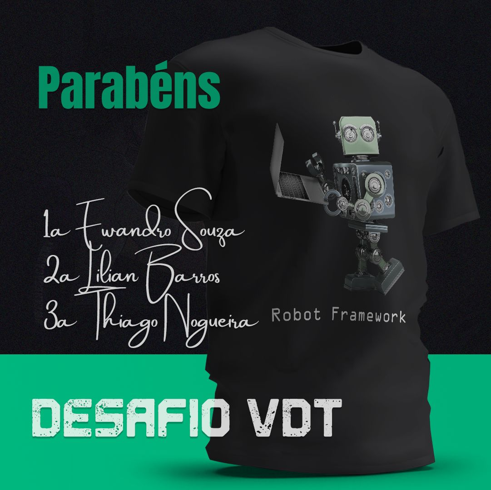

# Projeto de testes E2E realizado na 2ª temporada da série: Viver de Teste.

[](https://github.com/thinogueiras/VDT-Season02-RobotFramework/actions/workflows/continuous-testing.yml)

## Premiação do desafio VDT 🏅 🏅




## Pré-requisitos mínimos de ambiente 📋 💻

* [Python](https://www.python.org/downloads/) 3.10.12.

* [Node.js](https://nodejs.org/en) 18.17.1.


## Instalação do projeto 🚀 🚀

```
pip install -r requirements.txt
```

## Instruções 📢 📢

Executar o comando abaixo no terminal:

```
rfbrowser init
```

## Execução dos testes 🤖 🤖

* ### Firefox:

  ```
  robot -d ./reports -v BROWSER:firefox -v HEADLESS:False tests/
  ```

* ### Chromium:

  ```
  robot -d ./reports -v BROWSER:chromium -v HEADLESS:False tests/
  ```

## Relatórios 📝 📄

Verifique a pasta `reports` para visualizar os <b>relatórios</b> da execução: `report.html` ou `log.html`.

---

<a href="https://www.linkedin.com/in/thinogueiras"></a>

<strong>Thiago Nogueira dos Santos</strong> 🤓 ✌🏻

QA Automation Engineer 🔎 🐞
