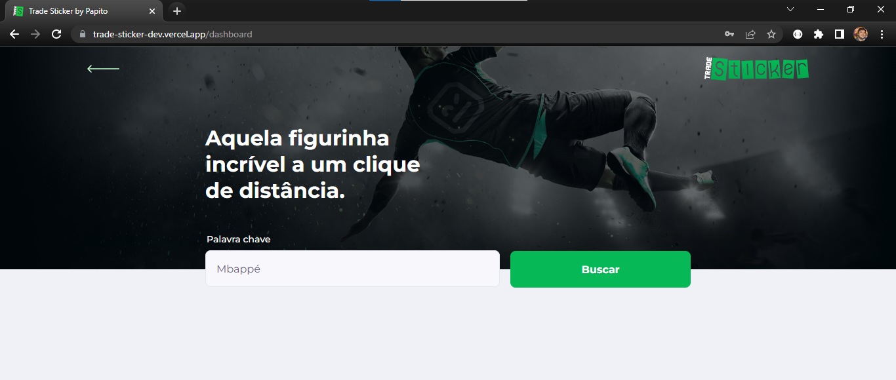
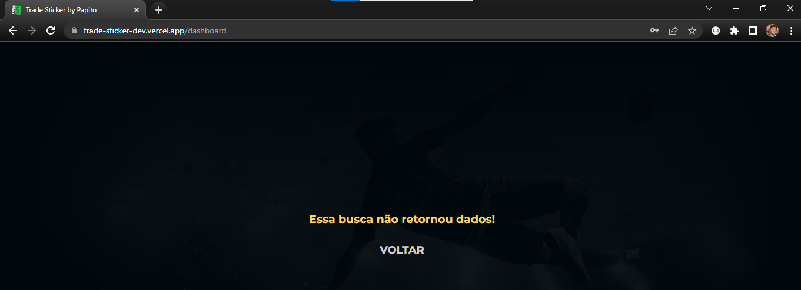

# Projeto de testes e2e realizado na 2ª temporada da série: Viver de Teste - 🚀 QACademy 🚀

## Ferramentas e tecnologias utilizadas:

    VSCode com o plugin Robot Code

    Robot Framework (Browser Library)

    Python 3.10.7

    Node.js 16.17.1 

## Pré-requisitos para a execução do projeto:

    Python: https://www.python.org/downloads/
    
    Observações importantes sobre a instalação do Python: 
        Selecionar a opção para adicionar o Python ao PATH do S.O.
        Escolher a instalação customizada.
        Selecionar para instalar para todos os usuários. 
        Altere o caminho da instalação para C:\Python310

    Node.js 16: https://nodejs.org/en/

    Git: https://git-scm.com/download/win (Necessário apenas se quiser realizar o clone do projeto)
    
    Comandos necessários:

        pip install robotframework

        pip install -U pip

        pip install -U robotframework-browser

        rfbrowser init

## Executando o projeto:

    Abrir o Git Bash ou qualquer outro terminal integrado ao Git.

    Escolha uma pasta no seu S.O e entre nela para realizar o comando abaixo:

    git clone https://github.com/thinogueiras/VDT-Season02-RobotFramework.git    

    cd VDT-Season02-RobotFramework
    
    Rodar a suíte de testes no Firefox:

        robot -d ./logs -v BROWSER:firefox -v HEADLESS:False tests/

    Rodar a suíte de testes no Chromium:
    
        robot -d ./logs -v BROWSER:chromium -v HEADLESS:False tests/

## Após a execução da suíte de testes terminar, será exibido em tela o caminho onde consta o log.html para a consulta step by step de cada Caso de Teste e com screenshot anexado no relatório.

## Ponto de atenção ou um possível bug encontrado 🔎 🐞:

### Ao digitar Kylian Mbappé ou apenas Mbappé, o sistema não encontra a figurinha correspondente ao jogador e exibe um alerta em tela, mas é possível encontrá-la digitando apenas Kylian, porém, o craque francês é conhecido mundialmente como Mbappé, poucos o conhecem pelo seu primeiro nome.

<h1 align="center">
    
</h1>

<h1 align="center">
    
</h1>

<strong>Thiago Nogueira dos Santos.  
Quality Assurance Analyst. </strong>

**LinkedIn:** https://www.linkedin.com/in/thinogueiras/
